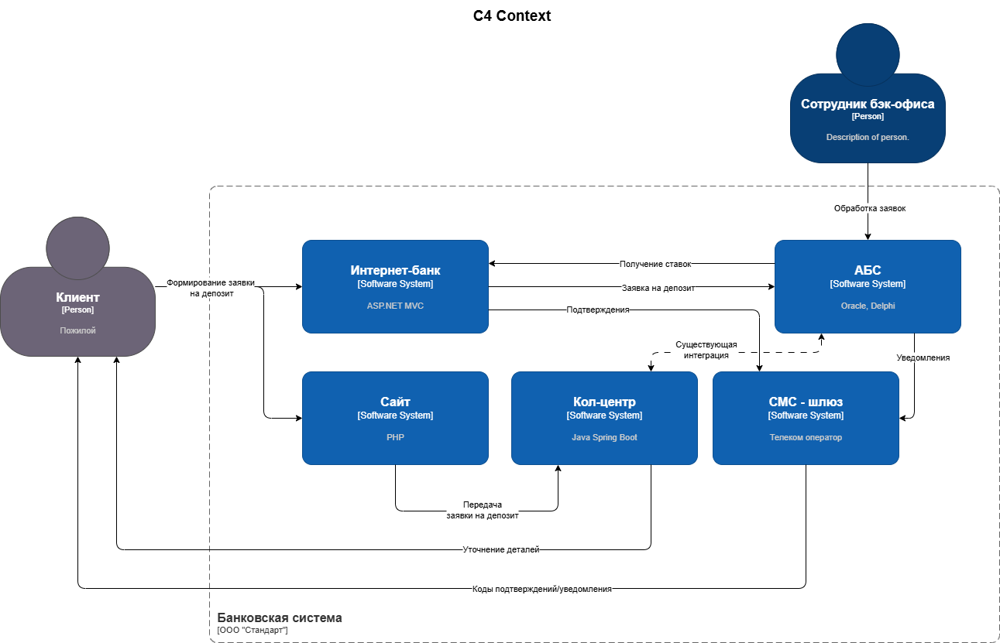
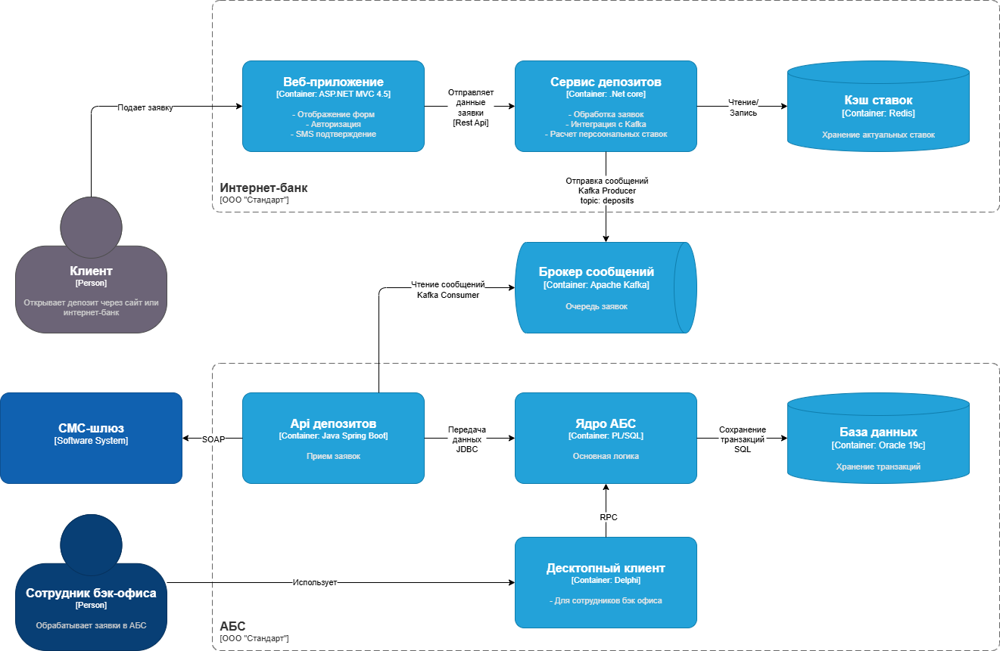

### **Название задачи:** схема промежуточной концептуальной архитектуры открытия депозитов
### **Автор:** 
### **Дата:** 30.07.2025
### **Функциональные требования**
Опишите здесь верхнеуровневые Use Cases. Их нужно оформить в виде таблицы с пошаговым описанием:

| **№** | **Действующие лица или системы** | **Use Case**                         | **Описание**                                                                                                                                                     |
| :---: | :------------------------------- | :----------------------------------- | :--------------------------------------------------------------------------------------------------------------------------------------------------------------- |
|   1   | Клиент, Сайт                     | Подача заявки на депозит через сайт  | 1. Клиент выбирает депозит на сайте 2. Заполняет форму (ФИО, телефон) 3. Система шифрует данные и передаёт в кол-центр 4. Клиент получает подтверждение |
|   2   | Клиент, Интернет-банк            | Подача заявки на депозит в ИБ        | 1. Клиент авторизуется в ИБ 2. Видит персонализированные ставки 3. Выбирает счёт/сумму 4. Подтверждает SMS-кодом 5. Система создаёт заявку           |
|   3   | Кол-центр, АБС                   | Обработка заявки с сайта             | 1. Менеджер видит заявку в системе кол-центра 2. Звонит клиенту 3. Фиксирует результат в CRM 4. Передаёт данные в АБС                                   |
|   4   | Бэк-офис, АБС                    | Подтверждение заявки на депозит      | 1. Сотрудник бэк-офиса видит заявку в АБС 2. Проверяет данные 3. Подтверждает ставку 4. Система открывает депозит и отправляет SMS                      |

### **Нефункциональные требования**
Опишите здесь нефункциональные требования и архитектурно значимые требования.

| **№** | **Требование**                                        |     |
| :---: | :---------------------------------------------------- | --- |
|   1   | Время отклика интерфейса < 500 мс                     |     |
|   2   | Доступность 99.9% для интернет-банка и АБС            |     |
|   3   | Шифрование данных при передаче (TLS 1.3+)             |     |
|   4   | Горизонтальное масштабирование интернет-банка         |     |
|   5   | Асинхронная обработка заявок через Kafka              |     |
|   6   | Совместимость с MS SQL (интернет-банк) и Oracle (АБС) |     |
### **Решение**

> [!NOTE]
> Приведите диаграммы контекста и контейнеров в модели C4. Опишите там основные компоненты и интеграции всех элементов решения. 

Диаграмма контекста

Диаграмма контейнеров

> [!NOTE]
> Также опишите, какой логикой вы руководствовались в ходе принятия решений и выбора технологий. Не забывайте, что необходимо учесть все функциональные и нефункциональные требования.

При проектировании MVP для онлайн-открытия депозитов были учтены:
1. **Функциональные требования** (из FURPS+ и Use Cases),
2. **Нефункциональные требования** (производительность, безопасность, масштабируемость),
3. **Ограничения текущего IT-ландшафта** (legacy-системы, экспертиза команды).

##### **Асинхронная обработка заявок (Kafka)**
- **Проблема**: Прямая интеграция интернет-банка с АБС перегружает базу Oracle.
- **Решение**:
    - Заявки отправляются в Kafka, а затем постепенно обрабатываются АБС.
    - **Почему Kafka?**
        - Поддержка высокой нагрузки (горизонтальное масштабирование).
        - Совместима с Java (есть экспертиза в команде АБС).
        - Гарантирует доставку сообщений даже при сбоях.
- **Компромисс**: Требует внедрения новой инфраструктуры, но снижает риски для АБС.

##### **Микросервис для депозитов в интернет-банке**
- **Проблема**: Монолит на ASP.NET MVC 4.5 не поддерживает Kafka и сложно масштабируется.
- **Решение**:
    - Выделение сервиса депозитов в отдельный микросервис на .NET Core.
    - **Почему .NET Core?**
        - Совместимость с текущим стеком банка (MS SQL, .NET Framework).
        - Поддержка современных протоколов (gRPC, REST API).
        - Возможность работы с Kafka через библиотеки (например, Confluent.Kafka).

##### **Кэширование ставок (Redis)**
- **Проблема**: Задержки при расчёте ставок (>1 сек).
- **Решение**:
    
    - Кэширование актуальных ставок в Redis.
    - **Почему Redis?**
        - Низкая задержка (<1 мс).
        - Подходит для часто обновляемых данных (ставки меняются ежедневно).

##### **Шифрование данных (TLS 1.3+)**
- **Проблема**: Передача персональных данных между системами.
- **Решение**:
    - Обязательное использование TLS для всех интеграций.
    - **Почему TLS 1.3?**
        - Современный стандарт с улучшенной производительностью и безопасностью.
        - Поддерживается всеми системами банка (ASP.NET, Java Spring Boot).

### **Альтернативы**

> [!NOTE]
> Опишите здесь наиболее важные альтернативные решения.

**Недостатки, ограничения, риски**
1. **Kafka vs. RabbitMQ**:
    - Kafka выбрана из-за поддержки больших нагрузок, но требует обучения команды.
2. **Микросервисы vs. Монолит**:
    - Только критичный функционал вынесен в микросервис (депозиты), чтобы минимизировать сложность.
3. **Резервный ЦОД**:
    - Пока используется cold standby (переключение вручную), но в будущем — hot standby.

**Зависимости**
- **Подрядчик интернет-банка**:
    - Необходимо обновить ядро системы для поддержки .NET Core.
- **Команда АБС**:
    - Должна разработать API для приёма заявок из Kafka.
