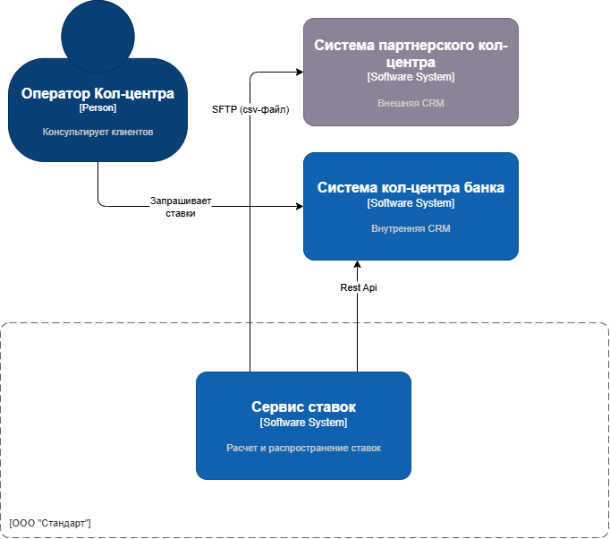
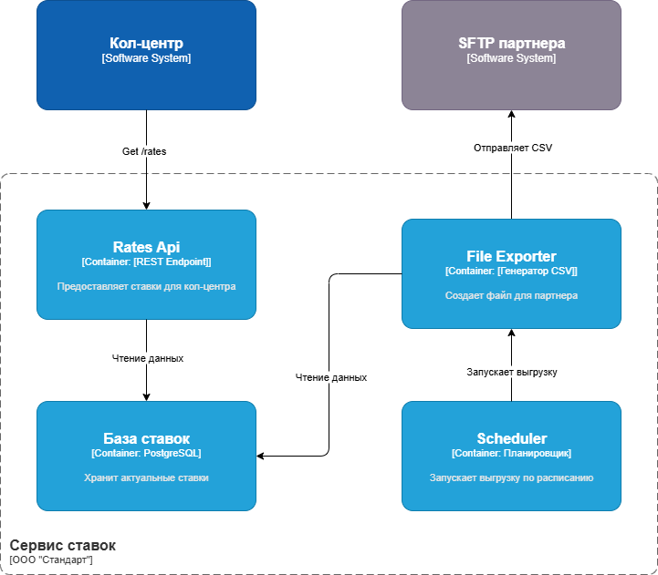

### **Название задачи:** Интеграция систем кол-центра с актуальными депозитными ставками
### **Автор:**
### **Дата:** 04.08
### **Функциональные требования**
Опишите здесь верхнеуровневые Use Cases. Их нужно оформить в виде таблицы с пошаговым описанием:

| **№** | **Действующие лица или системы**            | **Use Case**                                       | **Описание**                                                                                                  |
| :---: | :------------------------------------------ | :------------------------------------------------- | :------------------------------------------------------------------------------------------------------------ |
|   1   | Система кол-центра, REST API сервиса ставок | Получение актуальных ставок внутренним кол-центром | 1. Система кол-центра вызывает REST API сервиса ставок 2. Отображает ставки оператору.                     |
|   2   | Сервис ставок, Система партнера             | Обновление ставок у партнёрского кол-центра        | 1. Сервис ставок генерирует CSV-файл. 2. Отправляет на SFTP партнёра 3. Система партнёра загружает файл |
|   3   | Сотрудник кол-центра, CRM                   | Ручная проверка ставок сотрудником                 | 1. Оператор запрашивает ставки через интерфейс 2. Система показывает данные из кэша/файла                  |
### **Нефункциональные требования**
Опишите здесь нефункциональные требования и архитектурно-значимые требования.

| **№** | **Требование**                                    |
| :---: | :------------------------------------------------ |
|   1   | Доступность API: 99.9%.                           |
|   2   | Задержка ответа API: < 500 мс.                    |
|   3   | Защита данных: HTTPS для API, SSH-ключи для SFTP. |
|   4   | Аудит: Фиксация времени обновления ставок.        |
### **Решение**

Диаграмма контекста

Диаграмма контейнеров

Логика принятия решения:

1. Определить источник данных: ставки по депозитам сейчас рассчитываются вручную в Excel и зависят от данных из АБС и отдела кредитования. В рамках MVP и целевого состояния мы должны автоматизировать расчет ставок и сделать их доступными.

2. Для кол-центра банка: так как они используют свою систему (микросервисы на Java Spring Boot), то можем предоставить API для получения ставок.

3. Для партнерского кол-центра: они могут получать только файлы. Поэтому нужно организовать выгрузку файла с актуальными ставками и передачу его по SFTP.

4. Также нужно учесть, что ставки обновляются ежедневно (как в текущем процессе).

План:

- Сервис ставок (Interest Rate Service) будет ежедневно (или при изменении) публиковать актуальные ставки.

- Для кол-центра банка: создадим API в сервисе ставок, чтобы кол-центр мог делать запрос и получать ставки.

- Для партнерского кол-центра: создадим компонент, который будет выгружать ставки в файл (например, CSV) и передавать его на SFTP-сервер, доступный партнеру.
### **Альтернативы**

|                                         | +                      | -                                             |
| --------------------------------------- | ---------------------- | --------------------------------------------- |
| **Единое API для обоих кол-центров**    | Упрощение архитектуры  | Партнёр не поддерживает API                   |
| **Почтовая рассылка файлов партнёру**   | Не требует разработки  | Ненадёжно, медленно, риск утечек              |
| **Доступ партнёра к БД сервиса ставок** | Прямой доступ к данным | Нарушает безопасность, сложность согласования |

